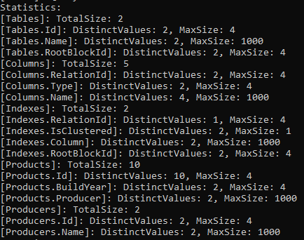
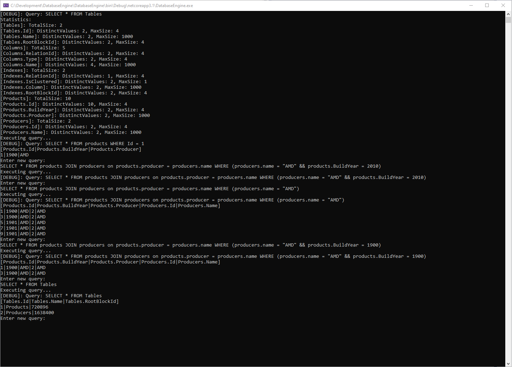
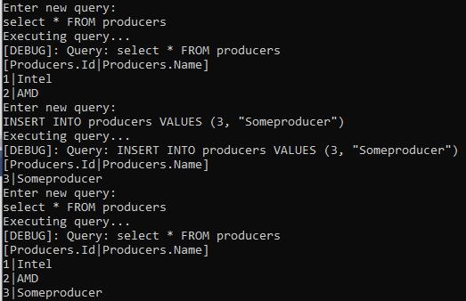
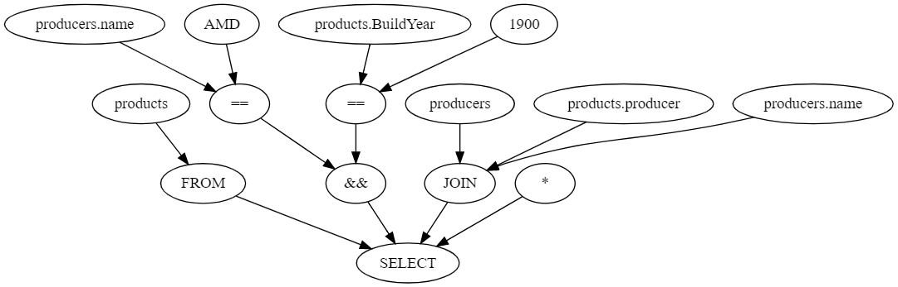
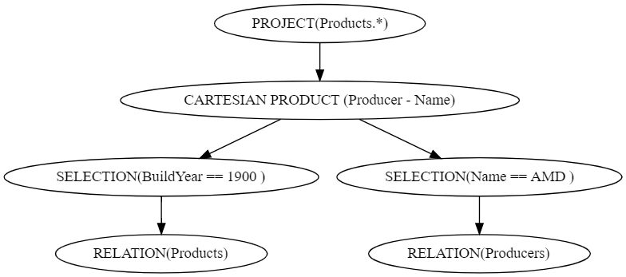
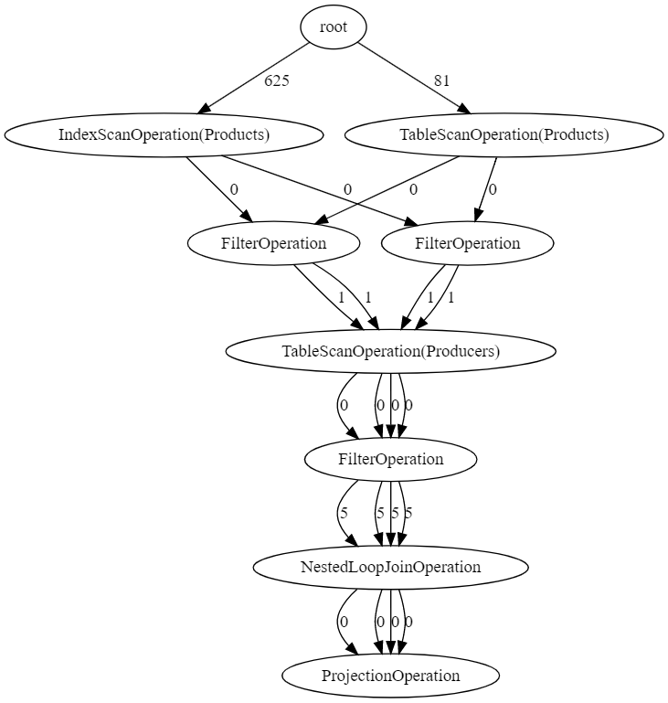

# Database engine

Database concepts described in the book DATABASE SYSTEMS (The Complete Book) were used for this project.

This database engine uses the [Jeroen compiler](https://compiler.jeroenvinke.nl/) to parse queries into a syntax tree. The syntax tree is then converted into a logical query plan. Based on table statistics costs are determined for every element in the logical query plan in order to come up with the cheapest physical query plan.

The B+ Tree structure is used for indexes (clustered and nonclustered). Only indexes with a single column are supported. Data and indexes are stored in one file (data.storage). The storage file contains 4k blocks, and a block typically contains data or part of an index structure. The win32 api is used to write and read from the storage file. 

### Features
**Supported grammar**  
Initial -> Command
Command -> Select Action | Insert Action
StringExpression -> String Action
Where -> Where BooleanExpression Action | EmptyString Action
Join -> Join Identifier On Identifier RelOp Identifier Action | EmptyString Action
Top -> Top Integer Action | EmptyString Action
SelectColumns -> Factors Action | Multiplication Action
Select -> Select Top SelectColumns From Identifier Join Where Action
Select -> Insert Into Identifier Values ParenthesisOpen Factors ParenthesisClose Action
BooleanExpression -> BooleanExpression And BooleanExpression Action | BooleanExpression Or BooleanExpression Action | BooleanTerm Action
BooleanTerm -> ParenthesisOpen BooleanExpression Action ParenthesisClose | Factor RelOp Factor Action
Boolean -> Boolean Action
NumericExpression -> NumericTerm Action
NumericTerm -> NumericFactor Action
NumericFactor -> Identifier Action | ParenthesisOpen NumericExpression Action ParenthesisClose | Integer Action | FactorTerm Action
FactorTerm -> Identifier Action | NumericExpression Action | StringExpression Action | Select Action
Factors -> Factors Comma Factor Action | Factor Action | EmptyString Action
Identifier -> Identifier Action

**Table statistics**  

**Query execution**  

**Select by primary key**  
SELECT * FROM products WHERE Id = 1

**Show all tables in the database**  
SELECT * FROM Tables

**Inner loop joins**  
SELECT * FROM products JOIN producers on products.producer = producers.name WHERE (producers.name = "AMD" && products.BuildYear = 1900)

**Filters (AND, OR, combined)**  
SELECT * FROM products JOIN producers on products.producer = producers.name WHERE (producers.name = "AMD" && products.BuildYear = 1900)

**Projections**  
SELECT products.BuildYear, * FROM products

**Insert queries**  
  

### Example query:
>SELECT * FROM products JOIN producers on products.producer = producers.name WHERE (producers.name = "AMD" && products.BuildYear = 1900)

**1. Syntax tree**  

**2. Logical query plan**  

**3. Physical query plan determination**  

The table statistics are used to determined the estimated cost (IO and CPU) of different options for every logical element. A graph is generated containing all these physical operations (options). The path with least cost is chosen as "ultimate" physical query plan.

During execution, a memory buffer is used to temporarily buffer blocks that are read from storage. A maximum of 100 blocks are kept in memory.
